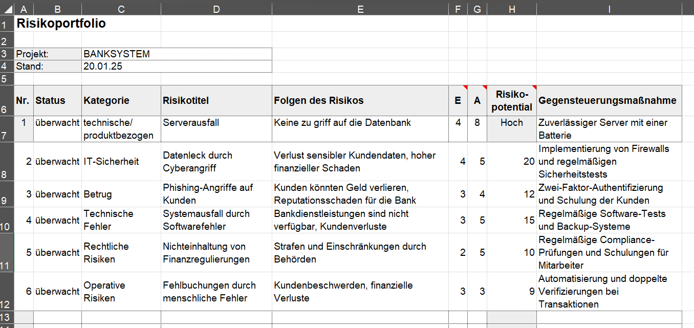

# Projekt Banking-System

## Zielsetzung unter Beachtung der SMART-Prinzipien

### Spezifisch
Wir werden ein Banking-System entwickeln, welches grundlegende Funktionen wie Einzahlung, Abhebung und Überweisungen ermöglicht.

### Messbar
Unser System wird ein voll Funktionstüchtiges Programm werden.

### Attraktiv
Das Projekt würde von allen Projektmitarbeitern zusammen besprochen und ausgesucht. Zudem bietet dieses Projekt einen großen Anzeiz wegen dessen komplexität.

### Realistisch

Dieses Banking-System ist zwar etwas komplexer, jedoch können wir durch unsere Programmierkenntnisse dies überwinden. 

### Terminiert

Das Projekt wird bis Ende des Schuljahres fertig gestellt.

## Projektorganisation

### Rollen:

 - Projektleiter: Janosch Walter
 - Projektmitarbeiter: Noah Kathrein und Mark Gritsch

### Form der Zusammenarbeit

Wir haben die Matrixorganisation gewählt da wir immer an zwei Dingen gleichzeitig arbeiten. Zu einem die Schulen im generellen, der wir viel Zeit widmen. Zum anderen unser Banking-System, bei dem wir auf Qualität und auf die Fertigstellung achten.

# Erstellung eines PSP

Geschrieben von Janosch:

Ich habe einen Projektstrukturplan erstellt, der die Arbeit in die drei Hauptebenen Vorbereitung, Durchführung und Abschluss gliedert. Jede dieser Ebenen enthält Unterebenen, die die spezifischen Aufgaben und Bereiche detailliert beschreiben, die wir durchführen müssen, um unser Ziel zu erreichen. Zusätzlich habe ich eine grobe Zeiteinteilung hinzugefügt, um die einzelnen Schritte zeitlich zu planen und die Umsetzung effizient zu gestalten.

# Erstellung eines PAP
Geschrieben von Noah:

Ich habe einen detaillierten Projektablaufplan erstellt, der die Arbeit der drei Hauptebenen in Form eines Gantt-Diagramms visualisiert. Der Plan ist in die drei Phasen Vorbereitung, Durchführung und Abschluss unterteilt, wie zuvor erläutert. Jede Hauptebene ist dabei klar strukturiert und in die entsprechenden Unterebenen gegliedert, um den Projektfortschritt übersichtlich darzustellen.

# Projektumfeldanalyse

Gemacht von Janosch:

Eine Projektumfeldanalyse untersucht interne und externe Einflüsse auf ein Projekt, identifiziert Stakeholder, Chancen und Risiken und klärt Rahmenbedingungen. Ziel ist es, das Projekt optimal zu planen und mögliche Herausforderungen frühzeitig zu adressieren.

### Schriftliche Dahrstellung

### Grafische Darstllung

### RisikoListe
Gemacht von Noah

